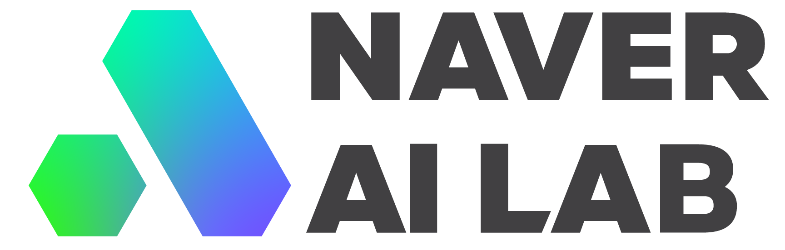

<br><br>

<p align="center">
  &nbsp;&nbsp;&nbsp;
  &nbsp;&nbsp;&nbsp;
  &nbsp;&nbsp;&nbsp;
  &nbsp;&nbsp;&nbsp;
  
</p>

<br>

# <p align="center">ReSCORE: Label-free Iterative Retriever Training for Multi-hop Question Answering with Relevance-Consistency Supervision</p>

<p align="center">
  <a href="https://arxiv.org/abs/">arXiv</a> | <a href="https://leeds1219.github.io/ReSCORE/">Project</a>
</p>

<p align="center">
  by <a href="https://leeds1219.github.io/">Dosung Lee</a>*,
  <a href="https://github.com/owj0421">Wonjun Oh</a>*,
  <a href="bykimby.github.io">Boyoung Kim</a>,
  <a href="https://github.com/EuroMinyoung186">Minyoung Kim</a>,
  <a href="http://www.mathcs.richmond.edu/~jpark/">Joonsuk Park</a>†,
  <a href="https://miil.korea.ac.kr/">Paul Hongsuck Seo</a>†
</p>

## Introduction

This is our official implementation of ReSCORE: Label-free Iterative Retriever Training for Multi-hop Question Answering with Relevance-Consistency Supervision! 


Multi-hop question answering (MHQA) requires reasoning across multiple documents, making dense retriever training challenging due to query variability. We propose ReSCORE, a method that trains dense retrievers without labeled data by leveraging LLMs to assess document relevance and consistency with answers.

For further details, please check out our [Paper](https://arxiv.org/abs/) and our [Project](https://leeds1219.github.io/ReSCORE/) page.

## :fire:TODO
- [x] Clean Code
- [ ] Batch, efficient pipeline refactoring
- [ ] Check Typo
- [x] Build Project Page
- [ ] Upload Revised Paper to arXiv, add Citation & Acknowledgement

## Installation
```
pip install -r requirements.txt
```

You need permission to access the [Llama-3.1-8B-Instruct](https://huggingface.co/meta-llama/Llama-3.1-8B-Instruct) model, or you can modify the [Script](/source/module/generate/llama.py) to use your own LLM.

We conducted all experiments using Python 3.10.12 on an NVIDIA A100 HBM2 40GB PCIe GPU, and the environments are listed in [Packages](./my_packages.txt), so please refer to it if any issues arise.

## Data Preparation
```bash
# Download MHQA datasets
sh script/download/multihop_raw_data.sh

# Preprocess and build Retrieval DB
sh script/download/build.sh
```

## Training
```
# Training
python -m source.run.train
--running_name {train}
--dataset {dataset}
```

<!--
We selected the checkpoints corresponding to the lowest validation loss within a single epoch.-->

#### Model Weights
| Model Weights | Link |
|--------------|------|
| Contriever-MSMARCO | [🔗 Click here](https://huggingface.co/facebook/contriever-msmarco) |
| IQATR-Musique | [🔗 Click here](https://huggingface.co/Lee1219/iqatr-musique) |
| IQATR-HotpotQA | [🔗 Click here](https://huggingface.co/Lee1219/iqatr-hotpotqa) |
| IQATR-2WikiMultiHopQA | [🔗 Click here](https://huggingface.co/Lee1219/iqatr-2wikimhqa) |

## Inference
```
# Inference
python -m source.run.inference
--method {base_or_iqatr}
--running_name {inference}
--dataset {dataset}
```

## Acknowledgement
This project includes code from [Contriever](https://github.com/facebookresearch/contriever), [DPR](https://github.com/facebookresearch/DPR), and [IRCoT](https://github.com/StonyBrookNLP/ircot).

This research was supported by the following grants:

- **IITP (Institute of Information & Communications Technology Planning & Evaluation)**  
  - IITP-2025-RS-2020-II201819  
  - IITP-2025-RS-2024-00436857  
  - IITP-2025-RS-2024-00398115  
  - IITP-2025-RS-2025-02263754  
  - IITP-2025-RS-2025-02304828

- **NRF (National Research Foundation of Korea)**  
  - NRF-2021R1A6A1A03045425

- **KOCCA (Korea Creative Content Agency)**  
  - RS-2024-00345025

Funded by the Korea government (**MSIT**, **MOE**, and **MSCT**).

## Citation
```BibTeX

```
